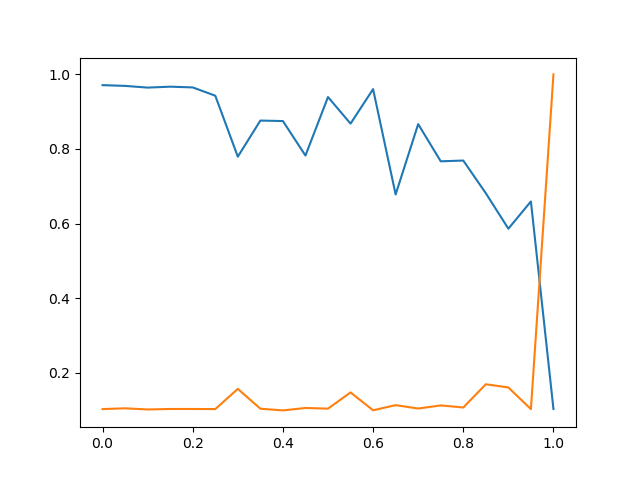

# Backdoor Attack against Neural Network

## Description

This directory demostrates a new type of attack against neural network.

The backdoor trigger in `backdor_square_trigger.py` is a black square located in the left-up corner of the image.

The result of this attack is:

The `poison rate` is the rate of the poison samples (samples have backdoor trigger) in whole dataset, how poison rate affect the __classification accuracy__ (the blue line) and attacker's __success rate__ (the orange line) is:

