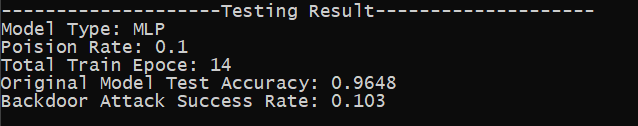

# Backdoor Attack against Neural Network

## Description

This directory demostrates a new type of attack against neural network.

The backdoor trigger in `backdor_square_trigger.py` is a black square located in the left-up corner of the image.

The result of this attack is:

